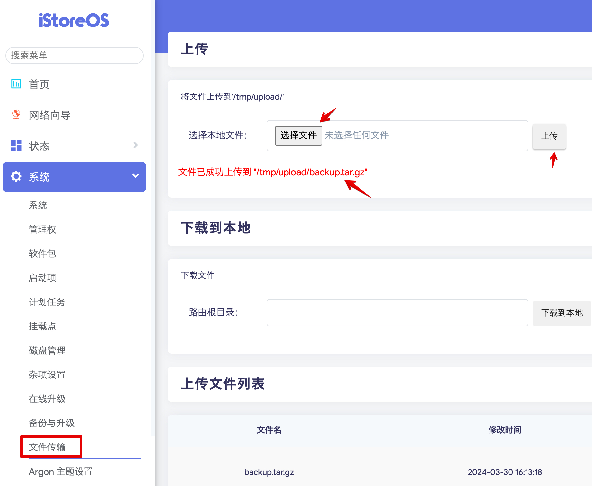

##  這是什麼？

該項目可以輕鬆備份iStoreOS已安裝的軟體和組態,當系統恢復出廠設定或重設後，可以一鍵恢復原來的軟體和組態。

改自 https://github.com/wukongdaily/OpenBackRestore/tree/master


---
## 如何使用？ 備份

- 開啟 cli 介面 
- 執行以下指令 有 兩種方式 A. B. 

A. 無腦生成備份在 /tmp folder 中

```
wget -O backup.run https://github.com/tbdavid2019/openwrt-backup-full-script/raw/main/backup.run && sh backup.run
```

B. 指定目錄 

```
wget -O backup.run https://github.com/tbdavid2019/openwrt-backup-full-script/raw/main/backup.run && chmod +x backup.run
```
假設要備份到 /mnt/mmc1-4 目錄

```
sh backup.run /mnt/mmc1-4
```


## 如何使用？ 恢復

- 開啟 cli 介面 
- 執行以下指令 有１種方式 A. 

A . 無腦恢復 

準備好 復原檔案 
格式為日期-iStorebk.tar.gz)
上傳到/tmp/upload目录



下載 sh 
```
wget -O restore.run https://github.com/tbdavid2019/openwrt-backup-full-script/raw/main/restore.run && chmod +x restore.run 
```

執行 
```
restore.run
```

